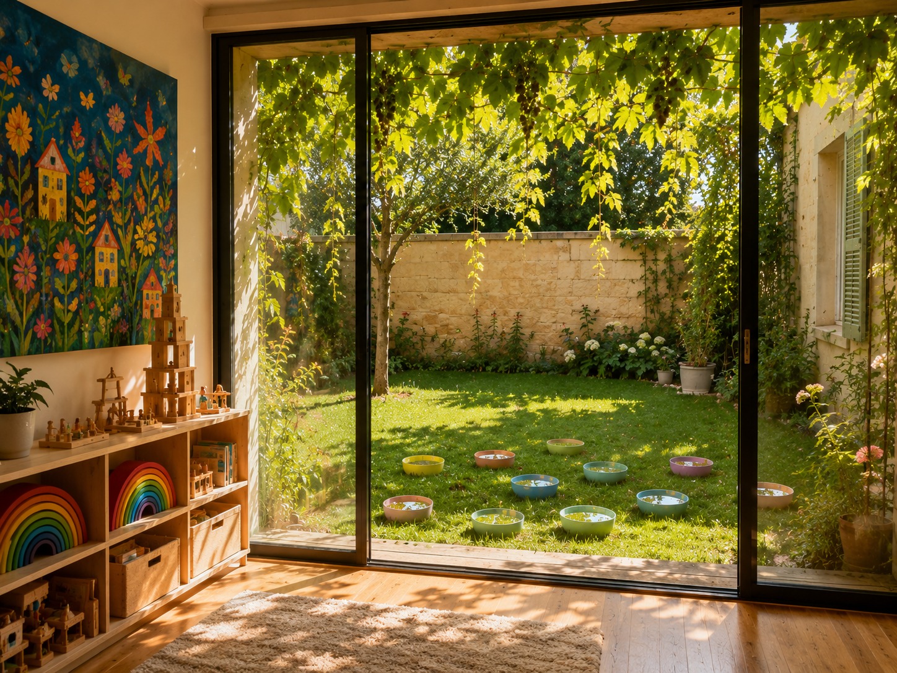

# 🌿 Symbiotic Nest (共生之巢 / Le Nid Symbiotique)

> *“这不仅是一栋房子，而是一个盛满童心、沉淀温柔的感官实验室。”*
> *"More than just a house, it is a sensory laboratory filled with childhood innocence and settled gentleness."*
> *"Plus qu'une simple maison, c'est un laboratoire sensoriel imprégné d'innocence enfantine et d'une douceur apaisante."*

---

## 🇨🇳 中文 | 🇺🇸 English | 🇫🇷 Français

### ✨ 愿景 / The Vision / La Vision

**[CN]** 那是一栋带着浅米色石头外墙和赤陶色瓦片的法式双层 Maison，在和煦的阳光下散发着沉淀的温柔。面向 150 平大草地的那面墙被彻底改造成了一整排极简的黑框大落地窗，模糊了室内外的界限。

**[EN]** A two-story French Maison with pale beige stone walls and terracotta tiles, radiating a settled gentleness under the warm sun. The wall facing the 150sqm lawn has been transformed into a row of minimalist black-framed floor-to-ceiling windows, blurring the boundary between inside and outside.

**[FR]** Une Maison française à deux étages, aux murs en pierre beige pâle et tuiles en terre cuite, dégageant une douceur apaisante sous un soleil radieux. Le mur faisant face à la pelouse de 150 m² a été entièrement transformé en une rangée de grandes baies vitrées minimalistes à cadres noirs, effaçant la frontière entre l'intérieur et l'extérieur.

  
   
  <em>视觉参考：室内外无缝连接的感官空间 / Visual Reference: The seamless sensory flow between interior and exterior / Référence Visuelle: Le flux sensoriel sans couture entre l'intérieur et l'extérieur</em>

---

### ☀️ 夏 · 流动 / Summer · Fluidity / Été · Fluidité

**[CN]** 巨大的橡树撑起一把绿色的遮阳伞。阳光穿过摇曳的葡萄藤，洒在散落于草地的 Stapelstein 水盆中，映照出深浅不一的绿意与温柔的涟漪。

**[EN]** A massive oak tree spreads its green parasol. Sunlight filters through the swaying grapevines to land in the Stapelstein water basins scattered across the lawn, reflecting a gradient of greens and gentle ripples.

**[FR]** Un grand chêne déploie son parasol de verdure. Les rayons du soleil traversent les treilles de vigne vacillantes pour venir se poser dans les vasques d'eau des blocs Stapelstein parsemés sur la pelouse, y reflétant un camaïeu de vert et de douces ondulations.

---

### 🍂 秋 · 折射 / Autumn · Refraction / Automne · Réfraction

**[CN]** 在一楼的大落地窗上，孩子们和我用透明的磁力片覆盖了整个窗面，拼成一棵巨大的“磁力许愿树”。夕阳金红且炽热的光芒毫无遮拦地穿透玻璃，经过磁力片晶体表面的折射，将地板、墙壁，甚至原木色的长椅，都染上了红、蓝、明黄的斑斓色彩。年长一点的孩子们直接躺在地板上，试图捕捉那些移动的光影，看着光线在地面上缓缓拉长。在那一刻，整个房间就像一个巨大的发光万花筒，美得近乎奇迹。

**[EN]** On the large ground-floor window, the children and I cover the entire glass surface with transparent magnetic tiles, composing a giant "magnetic wishing tree." The golden, incandescent light of the setting sun passes through the glass unobstructed. Refracted by the crystal facets of the tiles, it dresses the floor, walls, and even the raw wooden benches in shimmering reds, blues, and bright yellows. The older children lie on the floor, trying to catch these moving shadows of light, watching the rays stretch slowly across the ground. At that moment, the whole room resembles a giant luminous kaleidoscope, of an almost miraculous beauty.

**[FR]** Sur la grande baie vitrée du rez-de-chaussée, les enfants et moi couvrons toute la surface vitrée de plaques magnétiques transparentes, composant un immense « arbre à souhaits magnétique ». La lumière dorée et incandescente du soleil couchant traverse la vitre sans aucun obstacle. Réfractée par les facettes de cristal des plaques, elle habille le sol, les murs et même les bancs en bois brut de reflets chatoyants rouges, bleus et jaune vif. Les plus grands sont allongés par terre, essayant d'attraper ces ombres de lumière en mouvement, tandis qu'on regarde les rayons s'étirer lentement sur le sol. À cet instant, toute la pièce ressemble à un immense kaléidoscope lumineux, d'une beauté presque miraculeuse.

---

### ❄️ 冬 · 庇护 / Winter · Sanctuary / Hiver · Sanctuaire

**[CN]** 窗外，法国冬季标志性的细雨绵绵。葡萄藤只剩下光秃秃的枝桠，冷风吹得树梢摇曳。但在落地窗后，地暖全力运转，营造出一个温暖舒适的茧。二楼，成年人们在静谧中远程办公。一楼，就在玻璃窗前，我们和孩子们围坐在厚厚的地毯上，身边倾倒着几大箱原木色的 Kapla 积木。孩子们屏息凝神，将木块越垒越高，仿佛想触碰玻璃窗上的雨滴。突然，啪嗒！一座高塔倾覆。木块在地面上碰撞，发出清脆、治愈的咔哒声，宛如一场欧洲赤松的交响乐。孩子们不仅没有哭泣，反而爆发出阵阵笑声。透过覆盖着淡淡水汽的玻璃，窗外的寒雨、室内的原木香与孩子们的笑声形成了绝对的对比：这里，简直是世界上最安全的避风港。

**[EN]** Outside, that fine, continuous drizzle so typical of the French winter falls. The vine is nothing more than bare branches, and the cold wind sways the treetops. But behind the window, the underfloor heating is running at full capacity, creating a cozy cocoon. Upstairs, the adults telework in peace. On the ground floor, right in front of the glass wall, the children and we sit in a circle on a thick rug, surrounded by several large crates of raw wooden Kapla planks poured onto the floor. The children hold their breath, stacking the pieces of wood higher and higher, as if trying to touch the raindrops on the glass. Suddenly, crash! A great tower collapses. The planks clatter on the floor in a crystalline and so soothing clicking, like a symphony of Scots pine. Far from crying, the children burst into laughter. Through the glass covered in a light mist, the contrast between the cold rain outside, the scent of raw wood inside, and the children's laughter is absolute: this place is, quite simply, the safest haven in the world.

**[FR]** Dehors, il tombe cette petite pluie fine et continue si typique de l'hiver français. La vigne n'est plus faite que de branches nues et le vent froid fait tanguer la cime des arbres. Mais derrière la baie vitrée, le chauffage au sol tourne à plein régime, créant un cocon douillet. À l'étage, les adultes télétravaillent dans le calme. Au rez-de-chaussée, juste devant la verrière, les enfants et nous sommes assis en cercle sur un tapis épais, entourés de plusieurs grandes caisses de planchettes en bois brut Kapla déversées sur le sol. Les enfants retiennent leur souffle, empilant les morceaux de bois de plus en plus haut, comme pour essayer de toucher les gouttes de pluie sur la vitre. Soudain, patatras ! Une grande tour s'écroule. Les planchettes s'entrechoquent sur le sol dans un cliquetis cristallin et tellement apaisant, comme une symphonie de pin sylvestre. Loin de pleurer, les enfants éclatent de rire. À travers la vitre recouverte d'une légère buée, le contraste entre la pluie froide du dehors, le parfum de bois brut à l'intérieur et les éclats de rire des enfants est absolu : cet endroit est, tout simplement, le havre de paix le plus sûr au monde.

---

## 🧩 核心哲学 / Philosophy / Philosophie

*   **去机构化 / De-institutionalization / Dé-institutionnalisation**
*   **感官优先 / Sensory-First / Priorité aux Sens**
*   **低保真，高想象 / Low-Fi, High-Imagination / Basse fidélité, Haute imagination**
*   **共生空间 / Symbiotic Space / Espace Symbiotique**

---

## 🗺️ 空间映射 / Mapping / Cartographie

*   **室内 (Indoor / Intérieur):** 2层, 80-100 $\\text{m}^2$ (Oak / Espresso / Kaleidoscope).
*   **室外 (Outdoor / Extérieur):** 150 $\\text{m}^2$ (Oak tree / Vine trellis / Mud kitchen / Barefoot path).

---

*Detailed technical specifications $\\rightarrow$ [blueprint.md](./blueprint.md)*
*Spécifications techniques détaillées $\\rightarrow$ [blueprint.md](./blueprint.md)*
